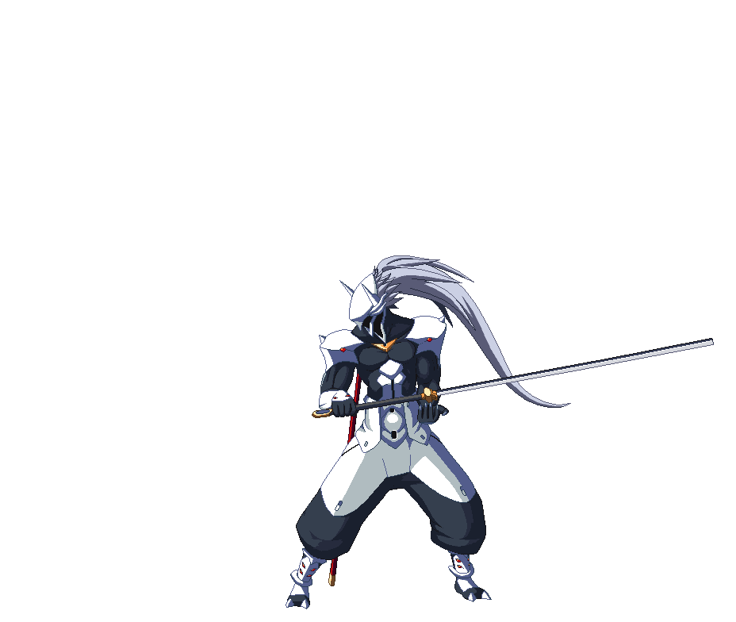

# [<p align="right"></p>](https://github.com/theyounglord/The-Big-Basket-C-Plus-Plus#)
# The-Big-Basket-C++
This repo is Developed to keep track of your learning status of C++ in accordance with [@Apna College - Youtube Channel](https://www.youtube.com/channel/UCBwmMxybNva6P_5VmxjzwqA/featured)(Subscribe them if you are Indian and want to learn c++). Even though if you are not indian and want to keep track of learning experience of Programming in C++. This repo could be very useful to you guys. So Very Welcome  all of you guys to this repo. 
## Why you should use this repo?
Before starting this repo i was not able to keep myself consistent and motivated towards my learning journey so i decided why not make a checklist repo which can somehow provide me a sense of achievement and also keep track of my learning the programming with c++. So thats when i decided to make this repo.

It's a long plan. It may take you months. If you are familiar with a lot of this already it will take you a lot less time.
## How to use this repo?

Everything below is an outline, and you should tackle the items in order from top to bottom.

I'm using Github's special markdown flavor, including tasks lists to track progress.

**Create a new branch so you can check items like this, just put an x in the brackets: [x]**

    Fork a branch and follow the commands below

Fork the GitHub repo https://github.com/theyounglord/The-Big-Basket-C-Plus-Plus by clicking on the Fork button on the top right corner of this repo or you can use the below method.

    Clone to your local repo

`git clone git@github.com:<your_github_username>/The-Big-Basket-C-Plus-Plus.git`

`git checkout -b progress`

`git remote add theyounglord https://github.com/theyounglord/The-Big-Basket-C-Plus-Plus`

`git fetch --all`

    Mark all boxes with X after you completed your changes

`git add .`

`git commit -m "Marked x"`

`git rebase theyounglord/main`

`git push --set-upstream origin progress`

`git push --force`

[More about Github-flavored markdown](https://guides.github.com/features/mastering-markdown/#GitHub-flavored-markdown)

#  Let's get started & Best of Luck
# Level-1  Getting Started 

- [ ] [Introduction to Programming Language](https://drive.google.com/file/d/1nq4TGnbP7k7o_ofNZJ4UDclEwWrn_iaF/view)

- [ ] [Install VScode](https://code.visualstudio.com/download)
- [ ] [Setup VScode with c++ ](https://code.visualstudio.com/docs/languages/cpp)
- [ ] Writing first program on c++
- [ ] [Data types](https://www.geeksforgeeks.org/c-data-types/)
- [ ] [Type Modifiers](https://www.tutorialspoint.com/cplusplus/cpp_modifier_types.htm)
## Understandig the syntex of Input Output in C++ [For Indians](https://www.youtube.com/watch?v=7dPdMtBX1d8&t=7s)/[Other than Indians](https://www.youtube.com/watch?v=I16GqVWJXKE)
- [ ] Write a program to take two numbers as input from the user and then find average of those two numbers
## Understanding the syntex of If/Else Statement [For Indians](https://www.youtube.com/watch?v=cyB3HNlQyjY&t=1s)/[Other than Indians](https://www.youtube.com/watch?v=mlOePMa8_P4)
- [ ] Program to find Maximum and minimum among two numbers
- [ ] Program to find Maximum of three numbers
- [ ] Program to find even or odd among two numbers ```Possible Case -Both Even -Both odd -One even && One odd -One odd && one even```
- [ ] Program to check if a triangle is scalene, isosceles or equilateral
- [ ] Program to check if an alphabet is a vowel or a consonant
## Understanding the concept of Loops [For Indians](https://www.youtube.com/watch?v=IlIn_D1RT7M&t=2s)/[Other than Indians](https://www.youtube.com/watch?v=_1AwR-un4Hk)
- [ ] Program to print hello world 10 times
- [ ] Program to print sum of n numbers
- [ ] Prgram to take input from user till user enters a negative number(Using While loop)
- [ ] Prgram to take input from user till user enters a negative number(Using Do While loop)
- [ ] Program to display multiplication table upto 10
- [ ] Program to add only positive numbers ```i.e take input from user again and again till he/she enters the negative integer and calculate the sum of all numbers till that point```
## Understanding the concept of jump statements [For Indians](https://www.youtube.com/watch?v=Stf7KBiA1vs&t=130s)/[Other than Indians](https://www.youtube.com/watch?v=ikGk4ZZ-uYE)
- [ ] There is a girl called Sara and her mother allows to go out with her friends only on even days of month.Also her mother gives some Pocket money each month to her and each time she goes out she spends 500 bucks.She also cannot go outside once she is left with no pocket money. Asumming that her mother gives atleast 3000 bucks every month. Write a Program to tell sara that on which dates she can go and when she have to stop
- [ ] Program to print all odd numbers  till n
- [ ] Program to print all the numbers between 1 to 100 except those numbers which are divisible by 3
- [ ] Program to check that whether given number is prime or not
- [ ] Program to print all prime numbers between a given range ```i.e. from a+1 to b-1```
## Understanding the concept of Switch Satements [For Indians](https://www.youtube.com/watch?v=G80-j_xnE_8&t=19s)/[Other than Indians](https://www.youtube.com/watch?v=GSja2w-HN20)
- [ ] Program to write hello in five different languages ```i.e. ask the user to enter the langauage key and the program will print hello in that particular language```
- [ ] Program to implement basic arithmetic operations between two number
## [Understanding the concept of Operators](https://drive.google.com/file/d/1QtBvLHK-8d-zPlKQp2pa3m_lgVnG1ecl/view)
- [ ] What is the output of following program?
```cpp
#include<bits/stdc++.h>
using namespace std;
int32_t main(){
    int i=1;
    i=i++ + ++i;
    cout<<i<<endl;
    return 0;
}
```
- [ ] What is the output of following program?
```cpp
#include<bits/stdc++.h>
using namespace std;
int32_t main(){
    int i=1;
    int j=2;
    int k;
    k=i + j + i++ + j++ + ++i + ++j;
    cout<<i<<" "<<j<<" "<<k<<endl;
    return 0;
}
```
- [ ] What is the output of following program?
```cpp
#include<bits/stdc++.h>
using namespace std;
int32_t main(){
    int i=0;
    i=i++ - --i + ++i - i--;
    cout<<i<<endl;
    return 0;
}
```
- [ ] What is the output of following program?
```cpp
#include<bits/stdc++.h>
using namespace std;
int32_t main(){
    int i=1,j=2,k=3;
    int m = i-- - j-- - k--;
    cout<<i<<endl;
    cout<<j<<endl;
    cout<<k<<endl;
    cout<<m<<endl;
    return 0;
}
```
- [ ] What is the output of following program?
```cpp
#include<bits/stdc++.h>
using namespace std;
int32_t main(){
    int i=10, j=20 ,k;
    k = i-- - i++ + --j - ++j + --i - j-- + ++i - j++;
    cout<<i<<endl;
    cout<<j<<endl;
    cout<<k<<endl;
    return 0;
}
```
- [ ] Program to take an integer as an input from the user and tell whether it is equal to, less than or more than 10
- [ ] Program to check that whether a number is divisible by both 2 and 3 or it is divisible by only one of them
- [ ] [Solve all questions in this pdf](https://drive.google.com/file/d/1QtBvLHK-8d-zPlKQp2pa3m_lgVnG1ecl/view)
# Level-1 - Completed
# Important anouncement before getting to the next level
```
The next phase is about building logics on your own, so try as hard as possible to build or find the logics

behind the Programs on your `NoteBooks`first and then code on your systems. Also if anyone wants to edit this 

repo in his/her own way. you guys are free to do. Thank you .
```
# Level-2  LogicBuilding phase
```
In this phase we are going to solve some pattern problems which will help you to develop an idea that how should we build the logics behind the problem with our learned concepts.
This Phase require an important set of time of your's, so that when we move on to the next levels, we'll have an idea in mind that how should we'll build the logics behind the problem.
```
`Success is very uncofertable process, so make yourself comfertable with being uncomfertable.`

`In this level we are going to solve some pattern Problems starting with easy once to the complex ones.`

`Solve all the below questions using nested for Loop.`
- [ ] Program to print rectangle where user provides number of rows and columns / [Solution](https://github.com/theyounglord/The-Big-Basket-C-Plus-Plus/blob/main/SOLUTION.md#rectangle-pattern)
```cpp
* * * *
* * * *
* * * *
* * * *
* * * *
```
- [ ] Program to print hollow rectangle where user provides number of rows and columns / [Solution](https://github.com/theyounglord/The-Big-Basket-C-Plus-Plus/blob/main/SOLUTION.md#hollow-rectangle-pattern)
```cpp
* * * *
*     *
*     *
*     *
* * * *
```
`
Hint:-
You have to print some spaces between the rectangle to make it hollow rectangle.
i.e You have to print spaces instaed of "*", similar to the above question  except in 1st row, last row, 1st column and last column.
`
- [ ] Print the given pattern w.r.t. variable n=5 ```i.e half Pyramid using numbers```take variable n as, only input to the program / [Solution](https://github.com/theyounglord/The-Big-Basket-C-Plus-Plus/blob/main/SOLUTION.md#half-pyramid-using-numbers-pattern)
```cpp
1
2 2
3 3 3
4 4 4 4
5 5 5 5 5
```
`
Hint:-
In this Program we have to iterate all the elements of row from 1 to n.
So that Row number = Number of Columns.
`
- [ ] Print the given pattern w.r.t. variable n=5 ```i.e Half Pyramid using numbers "0" & "1"```take variable n as, only input to the program /[Solution](https://github.com/theyounglord/The-Big-Basket-C-Plus-Plus/blob/main/SOLUTION.md#half-pyramid-using-numbers-0--1-pattern)
```cpp
1
0 1
1 0 1
0 1 0 1
1 0 1 0 1
```
`
Hint:-
This Program is very similar o the Half Pyramid using numbers Pattern.
But in this you just have to figure out that at which Position you should print "1" and vice versa for "0"
`
- [ ] Print the given pattern w.r.t. variable n=5 ```i.e Floyd's Triangle```take variable n as, only input to the program /[Solution](https://github.com/theyounglord/The-Big-Basket-C-Plus-Plus/blob/main/SOLUTION.md#floyds-triangle-pattern)
```cpp
1
2  3
4  5  6
7  8  9  10
11 12 13 14 15
```
- [ ] Print the given pattern w.r.t. variable n=5 ```i.e. inverted half pyramid using "*"``` take variable n as, only input to the program / [Solution](https://github.com/theyounglord/The-Big-Basket-C-Plus-Plus/blob/main/SOLUTION.md#inverted-half-pyramid-pattern)
```cpp
* * * * *
* * * *
* * *
* * 
*
```

`
Hint:-
In this Program we have to iterate all the elements of row from n to 1.
So that Row number = Number of Columns.
`
- [ ] Print the given pattern w.r.t. variable n=5 ```i.e. inverted half pyramid using numbers``` take variable n as, only input to the program / [Solution](https://github.com/theyounglord/The-Big-Basket-C-Plus-Plus/blob/main/SOLUTION.md#half-pyramid-using-numbers)
```cpp
1 2 3 4 5
1 2 3 4
1 2 3
1 2
1
```
- [ ] Print the given pattern w.r.t. variable n=5 ```i.e. half pyramid using after 180 degree rotaion using "*"``` take variable n as, only input to the program / [Solution](https://github.com/theyounglord/The-Big-Basket-C-Plus-Plus/blob/main/SOLUTION.md#half-pyramid-using-after-180-degree-rotaion)
```cpp
        *
      * *
    * * *
  * * * *
* * * * *
```
`
Hint:- In this Program you have to figure print some space first and then you have to print pattern using "*".
Consider this Program as a rectangle pattern in which we have to print some spaces where the elements of column is less than equal to (n-i).
`
- [ ] Print the given pattern w.r.t. variable n=5 ```i.e. rhombus using "*"``` take variable n as, only input to the program / [Solution](https://github.com/theyounglord/The-Big-Basket-C-Plus-Plus/blob/main/SOLUTION.md#rhombus-pattern)
```cpp
        * * * * *
      * * * * *
    * * * * *
  * * * * * 
* * * * *
```
`
Hint:-Consider this program as a rectangle after placing some spaces.
`
- [ ] Print the given pattern w.r.t. variable n=5 ```i.e. Hollow rhombus using "*"``` take variable n as, only input to the program / [Solution](https://github.com/theyounglord/The-Big-Basket-C-Plus-Plus/blob/main/SOLUTION.md#hollow-rhombus-pattern)
```cpp
        * * * * * 
      *       *   
    *       *     
  *       *       
* * * * *
```
`
Hint:-Consider this problem as a hollow rectangle with some spaces first.
`
- [ ] Print the given pattern w.r.t. variable n=5 ```i.e. Number Pattern``` take variable n as, only input to the program / [Solution](https://github.com/theyounglord/The-Big-Basket-C-Plus-Plus/blob/main/SOLUTION.md#number-pattern)
```cpp
    1
   1 2
  1 2 3
 1 2 3 4
1 2 3 4 5
```
`
Hint:-In this Program you have to print some spaces first as usual and then when you have to
print half Pyramid with an extra space after each element of the column to maintain the order and design of Pattern.
`
- [ ] Print the given pattern w.r.t. variable n=5 ```i.e. Palindromic Pattern``` take variable n as, only input to the program / [Need Hint?](https://github.com/theyounglord/The-Big-Basket-C-Plus-Plus/blob/main/HINTS.md#palindromic-pattern) / [Solution](https://github.com/theyounglord/The-Big-Basket-C-Plus-Plus/blob/main/SOLUTION.md#palindromic-pattern)
```cpp
        1
      2 1 2
    3 2 1 2 3
  4 3 2 1 2 3 4
5 4 3 2 1 2 3 4 5
```
- [ ] Print the given pattern w.r.t. variable n=5 ```i.e. Diamond Pattern using "*"``` take variable n as, only input to the program / [Need Hint ?](https://github.com/theyounglord/The-Big-Basket-C-Plus-Plus/blob/main/HINTS.md#diamond-pattern) / [Solution](https://github.com/theyounglord/The-Big-Basket-C-Plus-Plus/blob/main/SOLUTION.md#diamond-pattern)
```cpp
        * 
      * * *
    * * * * *
  * * * * * * *
* * * * * * * * * 
* * * * * * * * *
  * * * * * * *
    * * * * *
      * * *
        *
```
- [ ] Print the given pattern w.r.t. variable n=5 ```i.e. Hollow Diamond Pattern``` take variable n as, only input to the program / [Need Hint ?](https://github.com/theyounglord/The-Big-Basket-C-Plus-Plus/blob/main/HINTS.md#hollow-diamond-pattern) / [Solution](https://github.com/theyounglord/The-Big-Basket-C-Plus-Plus/blob/main/SOLUTION.md#hollow-diamond-pattern)
```cpp
        * 
      *   *
    *       *
  *           *
*               * 
*               *
  *           *
    *       *
      *   *
        *
```
- [ ] Print the given pattern w.r.t. variable n=5 ```i.e. Hollow Diamond inscribed in rectangle Pattern``` take variable n as, only input to the program / [Need Hint ?](https://github.com/theyounglord/The-Big-Basket-C-Plus-Plus/blob/main/HINTS.md#hollow-diamond-inscribed-in-rectangle-pattern) / [Solution](https://github.com/theyounglord/The-Big-Basket-C-Plus-Plus/blob/main/SOLUTION.md#hollow-diamond-pattern-inscribed-in-rectangle)
```cpp
* * * * * * * * * 
* * * *   * * * * 
* * *       * * * 
* *           * * 
*               * 
*               * 
* *           * * 
* * *       * * * 
* * * *   * * * * 
* * * * * * * * *
```

- [ ] Print the given pattern w.r.t. variable n=5 ```i.e. Buuter-Fly Pattern using "*"``` take variable n as, only input to the program/ [NeedHint?](https://github.com/theyounglord/The-Big-Basket-C-Plus-Plus/blob/main/HINTS.md#butterfly-pattern) / [Solution](https://github.com/theyounglord/The-Big-Basket-C-Plus-Plus/blob/main/SOLUTION.md#butter-fly-pattern) - `Try to Sove on your own without any hint`
```cpp
*        *
**      **
***    ***
****  ****
**********
**********
****  ****
***    ***
**      **
*        *
```
- [ ] Print the given pattern w.r.t. variable n=5 ```i.e. Hollow Buuter-Fly Pattern using "*"``` take variable n as, only input to the program / [Solution](https://github.com/theyounglord/The-Big-Basket-C-Plus-Plus/blob/main/SOLUTION.md#hollow-butter-fly-pattern) - `Try to Sove on your own without any hint`
```cpp
*        *
**      **
* *    * *
*  *  *  *
*   **   *
*   **   *
*  *  *  *
* *    * *
**      **
*        *
```
- [ ] Print the given pattern w.r.t. variable n=9 ```i.e. Zig Zag Pattern using "*"``` take variable n as, only input to the program / [Solution](https://github.com/theyounglord/The-Big-Basket-C-Plus-Plus/blob/main/SOLUTION.md#zig-zag-pattern) - `Try to Solve on your own without any hint`
```cpp
     *       *
   *   *   *   *
 *       *       *
```
# Level-2  LogicBuilding phase Completed
Well Congratulation now you have learned the basic concepts of Programming. And Now we are good to move to another level. Well if you ask me you are doing great and you just need to be consistent and have faith in you  that in a short time you'll gain the proper understanding of each and every concept.

In nexxt phase we are going to learn and undersand some important concepts of programming. 

Well if you are getting bored click on Mew and do your coding with some beats.,

[<p align="center"></p>](https://www.youtube.com/watch?v=_ITiwPMUzho)

# Level-3  New Era
## [Understanding the concept of Binary Number System](https://www.youtube.com/watch?v=QIyugGzih4k)
- [ ] Write a Program to check that given a given number is Prime or not
- [ ] Write a Program to reverse a number / [Solution](https://github.com/theyounglord/The-Big-Basket-C-Plus-Plus/blob/main/SOLUTION.md#revese-a-number)
- [ ] Write a Program to check that whether the number is armstrong or not / [Need hint?](https://github.com/theyounglord/The-Big-Basket-C-Plus-Plus/blob/main/HINTS.md#armstrong-or-not) / [Solution](https://github.com/theyounglord/The-Big-Basket-C-Plus-Plus/blob/main/SOLUTION.md#armstrong-or-not)
- [ ] Write a Program to convert a binary number to decimal number / [Solution](https://github.com/theyounglord/The-Big-Basket-C-Plus-Plus/blob/main/SOLUTION.md#binary-to-decimal)
- [ ] Write a Program to calculate the factorial of a number / [Need Hint](https://github.com/theyounglord/The-Big-Basket-C-Plus-Plus/blob/main/HINTS.md#factorial-of-number) / [Solution](https://github.com/theyounglord/The-Big-Basket-C-Plus-Plus/blob/main/SOLUTION.md#factorial)

## Understanding the concepts of Functions [For Indians](https://www.youtube.com/watch?v=83KtncYgHYQ&t=5s)/ [Other than indians](https://www.youtube.com/watch?v=BGmDRQzY4CA&t=3s)

- [ ] Program to add 2 numbers using functions / [Solution](https://github.com/theyounglord/The-Big-Basket-C-Plus-Plus/blob/main/SOLUTION.md#program-to-add-2-numbers-using-functions)
- [ ] Program to print a given number using functions / [Solution](https://github.com/theyounglord/The-Big-Basket-C-Plus-Plus/blob/main/SOLUTION.md#program-to-print-a-given-number-using-functions)
- [ ] Program to print the factorial of two numbers using functioms / [Solution](https://github.com/theyounglord/The-Big-Basket-C-Plus-Plus/blob/main/SOLUTION.md#program-to-print-the-factorial-of-two-numbers-using-functioms)
- [ ] Program to check whether the number is prime or not using functions / [Solution](https://github.com/theyounglord/The-Big-Basket-C-Plus-Plus/blob/main/SOLUTION.md#check-prime-or-not-using-function)
- [ ] Write a program to print all prime numbers between two numbers using functions / [Solution](https://github.com/theyounglord/The-Big-Basket-C-Plus-Plus/blob/main/SOLUTION.md#print-prime-betwwen-a-range-of-number)
- [ ] Program to find a fibonnaci sequence till n started from 0 and 1 / [Solution](https://github.com/theyounglord/The-Big-Basket-C-Plus-Plus/blob/main/SOLUTION.md#program-to-find-a-fibonaci-sequence-till-n)
- [ ] Program to find the factorial of the number using functions / [Solution]()
- [ ] Program to calculate nCr i.e Binary coefficient using functions /[Need Hint](https://github.com/theyounglord/The-Big-Basket-C-Plus-Plus/blob/main/HINTS.md#binary-coefficient) / [Solution](https://github.com/theyounglord/The-Big-Basket-C-Plus-Plus/blob/main/SOLUTION.md#program-to-calculate-ncr-ie-binary-coefficient-using-functions) 
- [ ] Program to print Pascal Triangle / [Hint](https://github.com/theyounglord/The-Big-Basket-C-Plus-Plus/blob/main/HINTS.md#pascal-triangle) / [Solution](https://github.com/theyounglord/The-Big-Basket-C-Plus-Plus/blob/main/SOLUTION.md#program-to-print-pascal-triangle)
```cpp
1 
1 1 
1 2 1 
1 3 3 1 
1 4 6 4 1
```
- [ ] Write a program to find out whether a given number is even or odd using functions / [Solution](https://github.com/theyounglord/The-Big-Basket-C-Plus-Plus/blob/main/SOLUTION.md#program-to-find-out-whether-a-given-number-is-even-or-odd-using-functions)
- [ ] Write a program to find out whether a given character is an alphabet or not using functions / [Solution](https://github.com/theyounglord/The-Big-Basket-C-Plus-Plus/blob/main/SOLUTION.md#program-to-find-out-whether-a-given-character-is-an-alphabet-or-not-using-functions)
- [ ] Write a program with two functions to print the maximum and the minimum number respectively among three numbers entered by user / [Solution](https://github.com/theyounglord/The-Big-Basket-C-Plus-Plus/blob/main/SOLUTION.md#program-with-two-functions-to-print-the-maximum-and-the-minimum-number-respectively-among-three-numbers-entered-by-user)
- [ ] Write a program with a function to swap the values of 2 given integer variables / [Solution](https://github.com/theyounglord/The-Big-Basket-C-Plus-Plus/blob/main/SOLUTION.md#program-with-a-function-to-swap-the-values-of-2-given-integer-variables)
- [ ] Write a program using functions to check if a person is eligible for voting or not by comparing his age with legal voting age i.e. 18 / [Solution](https://github.com/theyounglord/The-Big-Basket-C-Plus-Plus/blob/main/SOLUTION.md#program-using-functions-to-check-if-a-person-is-eligible-for-voting-or-not-by-comparing-his-age-with-legal-voting-age-ie-18)
- [ ] Program to find sum of first n natural numbers / [Solution](https://github.com/theyounglord/The-Big-Basket-C-Plus-Plus/blob/main/SOLUTION.md#sum-of-n-natural-numbers)
- [ ] Check whether the given triplet is pyhagorian triplet or not / [Solution](https://github.com/theyounglord/The-Big-Basket-C-Plus-Plus/blob/main/SOLUTION.md#check-whether-the-given-triplet-is-pyhagorian-triplet-or-not)
- [ ] Program to convert an octal number to decimal number / [Solution](https://github.com/theyounglord/The-Big-Basket-C-Plus-Plus/blob/main/SOLUTION.md#octal-number-to-decimal-number)
- [ ] Program to convert decimal to octal representation / [Solution](https://github.com/theyounglord/The-Big-Basket-C-Plus-Plus/blob/main/SOLUTION.md#decimal-to-octal-representation)
- [ ] Program to convert hexadecimal to decimal representation / [Solution](https://github.com/theyounglord/The-Big-Basket-C-Plus-Plus/blob/main/SOLUTION.md#hexadecimal-to-decimal-representation)
- [ ] Program to convert Decimal to Hexadecimal representation / [Solution](https://github.com/theyounglord/The-Big-Basket-C-Plus-Plus/blob/main/SOLUTION.md#decimal-to-hexadecimal-representation)
- [ ] Program to add two binary numbers / [Solution](https://github.com/theyounglord/The-Big-Basket-C-Plus-Plus/blob/main/SOLUTION.md#add-two-binary-numbers)

## Let's Optimize your code (Understanding Complexities of your code) [For indians](https://www.youtube.com/watch?v=rq_rwnveh8s&list=PLfqMhTWNBTe0b2nM6JHVCnAkhQRGiZMSJ&index=17) / [Other than Indians](https://www.youtube.com/watch?v=D6xkbGLQesk)
Well you are doing great but one thing that's making you slow is that you don't know what is the optimization of code and how to do that?
Before moving ahead let's understand What is optimization of code and how you can implement in your code and what is the importance of that.
## Understanding the concept of Array [For Indians](https://www.youtube.com/watch?v=PyTK_g1l8V8) / [Other than Indians](https://www.youtube.com/watch?v=eOdNhPwOInc)

- [ ] Program to declare array / [Solution](https://github.com/theyounglord/The-Big-Basket-C-Plus-Plus/blob/main/SOLUTION.md#program-to-declare-array)
- [ ] Program to take take input from user for array and then print array / [Solution](https://github.com/theyounglord/The-Big-Basket-C-Plus-Plus/blob/main/SOLUTION.md#program-to-take-take-input-from-user-and-then-make-array)
- [ ] Program to take input of an array of size n and then find maximum and minimum values / [Solution](https://github.com/theyounglord/The-Big-Basket-C-Plus-Plus/blob/main/SOLUTION.md#program-to-take-input-of-an-array-of-size-n-and-then-find-maximum-and-minimum-values)
- [ ] Program to print Kids With the Greatest Number of Candies / [Solution](https://github.com/theyounglord/The-Big-Basket-C-Plus-Plus/blob/main/SOLUTION.md#program-to-print-kids-with-the-greatest-number-of-candies)
```
EXPLANATION:-
There are n kids with candies. You are given an integer array candies, 
where each candies[i] represents the number of candies the ith kid has,
and an integer extraCandies, denoting the number of extra candies that you have.
Return a boolean array result of length n, where result[i] is true if, 
after giving the ith kid all the extraCandies, they will have the greatest number of candies among all the kids,
or false otherwise.
Note that multiple kids can have the greatest number of candies.
```
```cpp
Example 1:

Input: candies = [2,3,5,1,3], extraCandies = 3
Output: [true,true,true,false,true] 
Explanation: If you give all extraCandies to:
- Kid 1, they will have 2 + 3 = 5 candies, which is the greatest among the kids.
- Kid 2, they will have 3 + 3 = 6 candies, which is the greatest among the kids.
- Kid 3, they will have 5 + 3 = 8 candies, which is the greatest among the kids.
- Kid 4, they will have 1 + 3 = 4 candies, which is not the greatest among the kids.
- Kid 5, they will have 3 + 3 = 6 candies, which is the greatest among the kids.

Example 2:

Input: candies = [4,2,1,1,2], extraCandies = 1
Output: [true,false,false,false,false] 
Explanation: There is only 1 extra candy.
Kid 1 will always have the greatest number of candies, even if a different kid is given the extra candy.

Example 3:

Input: candies = [12,1,12], extraCandies = 10
Output: [true,false,true]

 

Constraints:

    n == candies.length
    2 <= n <= 100
    1 <= candies[i] <= 100
    1 <= extraCandies <= 50
```
- [ ] Program to print Running Sum of 1d Array / [Solution](https://github.com/theyounglord/The-Big-Basket-C-Plus-Plus/blob/main/SOLUTION.md#program-to-print-running-sum-of-1d-array)
```
Expalanation:-
Given an array nums. We define a running sum of an array as runningSum[i] = sum(nums[0]…nums[i]).
Return the running sum of nums.
```
```cpp
Example 1:

Input: nums = [1,2,3,4]
Output: [1,3,6,10]
Explanation: Running sum is obtained as follows: [1, 1+2, 1+2+3, 1+2+3+4].

Example 2:

Input: nums = [1,1,1,1,1]
Output: [1,2,3,4,5]
Explanation: Running sum is obtained as follows: [1, 1+1, 1+1+1, 1+1+1+1, 1+1+1+1+1].

Example 3:

Input: nums = [3,1,2,10,1]
Output: [3,4,6,16,17]
```
## Let's understand the concept of Searching / [For Indians](https://www.youtube.com/watch?v=13ocRMSJy5M) / Other than Indians- [LS](https://www.youtube.com/watch?v=4GPdGsB3OSc) / [BS](https://www.youtube.com/watch?v=P3YID7liBug)
- [ ] Program to implement linear search / [Solution](https://github.com/theyounglord/The-Big-Basket-C-Plus-Plus/blob/main/SOLUTION.md#linear-search)
- [ ] Program to implement binary search / [Solution](https://github.com/theyounglord/The-Big-Basket-C-Plus-Plus/blob/main/SOLUTION.md#binary-search)
## Let's Understand the Selection Sort / [For Indians](https://www.youtube.com/watch?v=dQa4A2Z0_Ro) / [Other than Indians](https://www.youtube.com/watch?v=xWBP4lzkoyM)
- [ ] Program to implement selection sort (Select the smallest num and swap with the first element) / [solution](https://github.com/theyounglord/The-Big-Basket-C-Plus-Plus/blob/main/SOLUTION.md#selection-sort)
- [ ] Let's Solve a riddle and write a program for this / [Solution](https://github.com/theyounglord/The-Big-Basket-C-Plus-Plus/blob/main/SOLUTION.md#chocolate-riddle)
```
Let's assume you have 15 rupeese . Now you go to shopkeeper's shop to buyt chocolates.
Now shopkeeper tell you that for each chocolate you have to pay 1 rupee.
And also you can buy 1 chocolate for 3 chocolate wrapers.
How many chocolates you can actually purchase
```
## Let's Understand the Bubble Sort / [For Indians](https://www.youtube.com/watch?v=xcPFUCh0jT0) / [Other than Indians](https://www.youtube.com/watch?v=nmhjrI-aW5o)
- [ ] Program to implement  bubble sort algorithm / [Solution](https://github.com/theyounglord/The-Big-Basket-C-Plus-Plus/blob/main/SOLUTION.md#bubble-sort)
## Let'sUnderstand the Insertion sort / [For Indians](https://www.youtube.com/watch?v=3GC83dh4cf0) / [Other than Indians](https://www.youtube.com/watch?v=OGzPmgsI-pQ)
- [ ] Program to implement the insertion sort algorithm / [Solution](https://github.com/theyounglord/The-Big-Basket-C-Plus-Plus/blob/main/SOLUTION.md#insertion-sort)
## Let's solve some of the important question related to the concepts we know till now
- [ ] Given an array a[] of size n. For every i from 0 to n-1 output max(a[0], a[1],..., a[i])


# [<p align="right"></p>](https://github.com/theyounglord/The-Big-Basket-C-Plus-Plus#the-big-basket-c)
